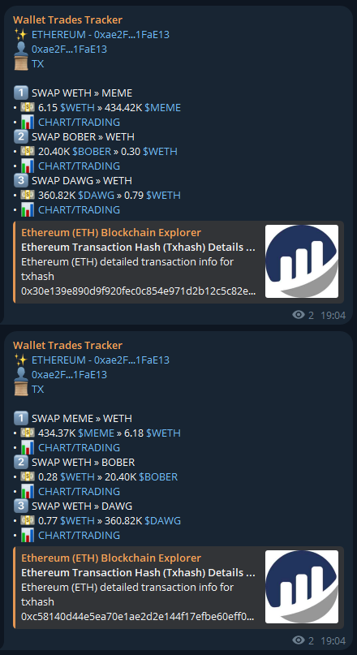

<h1 align="center">
Wallet Trades Tracker
</h1>
</p>
<p align="center">
    
    
    <br>
    
    
    <br>
    
    
    <br>
</p>

Wallet Trades Tracker is a tool that allows for **near-instant notifications whenever a wallet executes a swap on an EVM-compatible blockchain**.
At this moment, **the tool only supports Ethereum** but you can easily add others EVM-compatible blockchains.

Contact my for any inquiry<br>
[](https://discord.gg/_taodev_)
[](https://twitter.com/_TaoDev_)

## How it works
Each EVM-compatible blockchain bot will **scan each new block** to find wallets **matching those in the `wallets.txt`** file.
Upon finding a match, it will **check if the transaction is a swap**.
If so, it will then **notify this transaction using Discord and Telegram**.

## Features
- **Real-time monitoring**: Tracking each new swaps from any DEXs
- **Wallet filtering**: Allowing users to specify which wallets to track
- **Instant notification**: Sending real-time alerts via Discord, Telegram, or other platforms
- **Transaction analysis**: Providing details about transactions such as amounts, involved addresses, exchanged tokens
- **Integration with other services**: Integrating with other tools or platforms for a more comprehensive user experience

## Requirements

To run the tool, you will **need to have at least Python 3.6 installed on your system, along with the Python libraries**:
- `web3` (interacting with EVM-compatible blockchain)
- `multicall` (for making multi RPC calls)
- `web3-multi-provider` (to switch between different nnodes if main node is unavailable)
- `discord.py` (to create an embed for each notification)
- `python-dotenv` (for managing environment variables in Python applications)

## Installation

1. Clone this repository: `git clone https://github.com/0xTaoDev/Wallet-Trades-Tracker.git`
2. Install the required packages: `pip install -r requirements.txt`
3. Create a folder named .env, then inside it, create a file named .env and populate these variables with your own tokens:
```python
    DISCORD_WEBHOOK_URL=""
    TELEGRAM_BOT_TOKEN=""
    TELEGRAM_CHAT_ID=""
```
4. Edit `wallets.txt` with your own wallets to track (BLOCKCHAIN:ADDRESS | ETHEREUM:0xae2fc483527b8ef99eb5d9b44875f005ba1fae13)
5. Start the tool with `python run.py` inside main folder

## Screenshots




## Disclaimer

**This tool is provided for educational purposes only and should not be used as financial advice.**
**The tool does not have access to your wallet.**