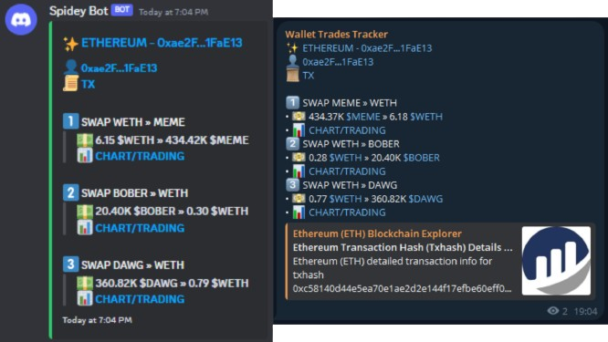

<h1 align="center">
🔎 Wallet Trades Tracker 🔍
</h1>

---

<p align="center">
    
    
    <br>
    
    
    <br>
    
    
    <br>
</p>

# 📖 Introduction
**Wallet Trades Tracker** is a Python tool that allows you to get notifications when a wallet from the list make a trade.
At this moment, **the tool only supports Ethereum** but it's probably working with others EVM-compatible blockchain.

# ⚠️ Disclaimer
**Please note that I'm not responsible for any loss of funds, damages, or other libailities resulting from the use of this software or any associated services.<br>
This tool is provided for educational purposes only and should not be used as financial advice, it is still in expiremental phase so use it at your own risk.**

## How it works 🔬
Each EVM-compatible blockchain bot will **scan every new block** to find wallets **matching those in the `wallets.txt`** file.
Upon finding a match, it will **check if the transaction is a swap**, if so, it will then **notify this transaction using Discord and Telegram**.

## Features ✨
- **Real-time monitoring**: Tracking each new swaps from any DEXs
- **Wallet filtering**: Allowing users to specify which wallets to track
- **Instant notification**: Sending real-time alerts via Discord, Telegram, or other platforms
- **Transaction analysis**: Providing details about transactions such as amounts, involved addresses, exchanged tokens...

## Requirements 📄

To run the tool, you will **need these packages**
- `web3` (interacting with EVM-compatible blockchain)
- `multicall` (for making multi RPC calls)
- `discord.py` (to create an embed for each notification)
- `python-dotenv` (for managing environment variables in Python applications)

## Installation 🛠️

1. Clone this repository: `git clone https://github.com/0xTaoDev/Wallet-Trades-Tracker.git`
2. Install the required packages: `pip install -r requirements.txt`
3. Create a virtual environnment : `python -m venv venv`
4. Populate these variables located in .env file located in the main directory.
```python
    DISCORD_WEBHOOK_URL=""
    TELEGRAM_BOT_TOKEN=""
    TELEGRAM_CHAT_ID=""
```
4. Edit `wallets.txt` with your own wallets to track<br>Format: BLOCKCHAIN:ADDRESS (e.g.:ETHEREUM:0xae2fc483527b8ef99eb5d9b44875f005ba1fae13)
5. Start the tool with `python run.py`

## Screenshots 📸

<p align="center">
    
    
</p>

# 📝 TO-DO
- [ ] Integrate others EVM-compatible blockchains

# 🤝 Contributions
If you are interesting in contributing, fork the repository and submit a pull request in order to merge your improvements into the main repository.<br>
Contact me for any inquiry, I will reach you as soon as possible.<br>
[](https://discord.gg/QxwPGcXDp7)
[](https://twitter.com/_TaoDev_)

## License 🧾

This project is licensed under the MIT license. Feel free to edit and distribute this template as you like.<br>
See [LICENSE](LICENSE) for more information.
